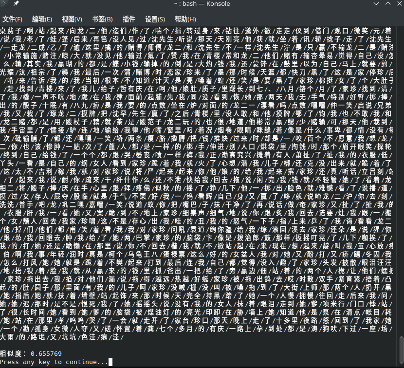
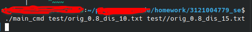
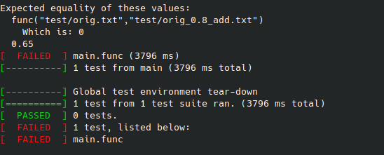

# 注：
#### 如果不是特别空闲且脑子没有坑，请用python或java来完成作业，C++并不适合文本处理，请不要向我一样浪费宝贵的时间😊

本作业在ubuntu中完成
项目使用方法：
main.cc
```
g++ main.cc -o main
/.main 
```
编译后可以直接运行

单元测试：

```
cd build
cmake ..
make
mv test ..
../test
```
建议把make出的可执行程序放在项目根目录（和main.cc放在一起），然后可直接运行。


## 另外...
1. mainbak.cpp 这个文件可以做到英文的查重（抄的，别在意）
2. 有些文件是没用的，例如cppjieba-master，而且有些头文件被我复制了很多次，nevermind
3. main_direct_run 可直接运行 main_cmd需带命令行参数
4. 这种东西随便看看得了，我瞎写的成分居多，有错的话会改正的XD，能帮到您一点的话麻烦点个星orz


| 软件工程 |https://edu.cnblogs.com/campus/gdgy/CSGrade21-12|
|---------|------------------------------------------------|
| 作业要求|https://edu.cnblogs.com/campus/gdgy/CSGrade21-12/homework/13014|
| 作业目标 |个人项目|


github链接 ： https://github.com/FHTHomeworkAtgdut/3121004779
## PSP表：
| PSP                                     | Personal Software Process Stages | 预估耗时（分钟） | 实际耗时（分钟） |
| --------------------------------------- | -------------------------------- | -------- | -------- |
| Planning                                | 计划                               | 60      | 90      |
|  Estimate                              | 估计这个任务需要多少时间                   | 320      | 420      |
| Development                             | 开发                               | 300      | 300      |
| Analysis                              |  需求分析 (包括学习新技术)                 | 120      | 180      |
|  Design Spec                           |  生成设计文档                         | 30       | 10       |
|  Design Review                         |  设计复审                           | 30       | 10       |
|  Coding Standard                       |  代码规范 (为目前的开发制定合适的规范)           | 10       | 5        |
|  Design                                |  具体设计                           | 10       | 5        |
|  Coding                                |  具体编码                           | 120      | 120      |
|  Code Review                           |  代码复审                           | 20       | 10        |
|  Test                                  |  测试（自我测试，修改代码，提交修改）             | 40       | 40       |
| Reporting                               | 报告                               | 30       | 20       |
|  Test Repor                            |  测试报告                           | 20       | 10       |
|  Size Measurement                      |  计算工作量                          | 5        | 5        |
|  Postmortem & Process Improvement Plan |  事后总结, 并提出过程改进计划                | 5        | 5        |
| Total                                   | 总计                               | 1120     |  1225     |

## 环境
ubuntu 
c++11


## 功能解析

读取文件文本，并去除标点符号，便于分词。
```cpp
string getFileData(string filePath){
  ifstream file;
  file.open(filePath);


  string line = "";
  string buf;
  while(getline(file,buf)){
    wstring ws = conv.from_bytes(buf);
    wstring nws;
    //过滤每一行中的标点和空格
    for (wchar_t ch : ws){
        if (!iswpunct(ch) && !iswspace(ch)){
          if(ch!=L'，'&&ch!=L'。'&&ch!=L'？'&&ch!=L'！'&&ch!=L'“'&&ch!=L'”'&&ch!=L'：'&&ch!=L'、')
            nws.push_back(ch);
        }

    }
    string ns = conv.to_bytes(nws);
  
    line += ns;
  }
  file.close();
  return line;
}
```

jieba库进行分词，并转换为字符串数组
```cpp
vector<string> cutWord(string src){
  cppjieba::Jieba jieba("dict/jieba.dict.utf8",
                      "dict/hmm_model.utf8",
                      "dict/user.dict.utf8",
                      "dict/idf.utf8",
                      "dict/stop_words.utf8");
  vector<string> words;
  jieba.Cut(src, words, true);
      for (auto& word : words) {
        cout << word << "/";
    }
    cout<<endl<<endl;
  return words;
}
```

计算相似度，先初始化数组，再用动态规划“填表”，计算出重复率；
```cpp
double Similarity_Cal(vector<string> word1,vector<string> word2){
    int m = word1.size();
    int n = word2.size();

    vector<vector<int>> dp(m + 1, vector<int>(n + 1, 0));

    for (int i = 0; i <= m; ++i) {
        dp[i][0] = i;
    }
    for (int j = 0; j <= n; ++j) {
        dp[0][j] = j;
    }

    for (int i = 1; i <= m; ++i) {
        for (int j = 1; j <= n; ++j) {
            int insertion = dp[i][j - 1] + 1;
            int deletion = dp[i - 1][j] + 1;
            int substitution = dp[i - 1][j - 1] + (word1[i - 1] != word2[j - 1]);

            dp[i][j] = min({insertion, deletion, substitution});
        }
    }

    double similarity = 1.0 - static_cast<double>(dp[m][n]) / max(m, n);

    return similarity;
}
```

## 结果：

命令行传入参数


可以输出分词的结果，并最后计算相似度；


## 性能分析：
 # 时间耗费：

单位为s；
动态规划的性能已经非常优秀，暂时没有更好的改进方法


## 单元测试
用googletest+cmake进行测试

CMakeLists.txt
```

cmake_minimum_required(VERSION 3.12) 

project(gUnittest)
# 相对路径
add_subdirectory(googletest) 

include_directories(googletest/include) 

# 添加一个测试：名称和可执行文件
add_executable(test test.cpp) 

target_link_libraries(test PRIVATE gtest) 


```

test测试文件：
```cpp

#include "gtest/gtest.h"
#include "main.cc"

TEST(main, func)
{
    GTEST_ASSERT_EQ(func("test/orig.txt","test/orig_0.8_add.txt"), 0.65);
}

int main(int argc, char* argv[])
{
    ::testing::InitGoogleTest(&argc, argv);
    return RUN_ALL_TESTS();
}

```
使用此文件进行测试时需要将原来的main函数注释掉，避免冲突。

测试结果：



